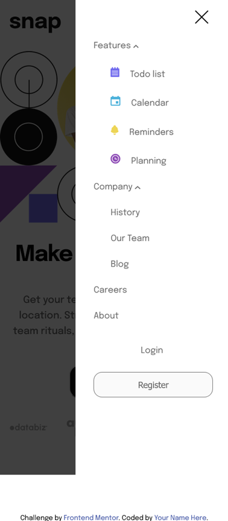

# Frontend Mentor - Intro section with dropdown navigation solution

This is a solution to the [Intro section with dropdown navigation challenge on Frontend Mentor](https://www.frontendmentor.io/challenges/intro-section-with-dropdown-navigation-ryaPetHE5). Frontend Mentor challenges help you improve your coding skills by building realistic projects. 

## Overview

### The challenge

Users should be able to:

- View the relevant dropdown menus on desktop and mobile when interacting with the navigation links
- View the optimal layout for the content depending on their device's screen size
- See hover states for all interactive elements on the page

### Screenshot




### Links

- Solution URL: [https://github.com/toshirokubota/intro-section-with-dropdown-navigation](https://github.com/toshirokubota/intro-section-with-dropdown-navigation)
- Live Site URL: [https://toshirokubota.github.io/intro-section-with-dropdown-navigation/](https://toshirokubota.github.io/intro-section-with-dropdown-navigation/)

## My process

### Built with

- Semantic HTML5 markup
- CSS custom properties
- Flexbox
- CSS Grid
- Mobile-first workflow

### What I learned

1. how to make a navigation bar from scratch.

1. how to implement dropdown menus.

The menues go to the nav-bar for the desktop version and to a modal window for the mobile version. I could either implement separate sets of dropdown menues for each case or prepare just one and moves it programmatically based on the device. I chose the latter, as it seems to be easier to maintein. 

1. how to invoke a onclick callback with key strokes, in a generic way. A snipet of code used in this project is shown below. I just have to add 'clickable' class to each html element with a onclick callback.

```js
  const clickables = document.querySelectorAll('.clickable');
  [...clickables].forEach(elm => 
    elm.addEventListener('keydown', function(event) { 
    if (event.key === 'Enter' || event.key === ' ') { 
      event.preventDefault(); 
      this.click();  
    }
  }));

```

### Continued development

- I want to keep practicing flexbox and grid layouts. 

- I will focus on writing a simple style sheet. 

- I want to start learning SASS.

### Useful resources

- [navigation bar tutorial](https://www.youtube.com/watch?v=OjQP7rPwJyE) - This relatively short video shows how to implement a nav-bar and a hamburger icon.
- [onclick event handler issue](https://stackoverflow.com/questions/1553661/how-to-get-the-onclick-calling-object) - This stack overflow article tells how to 
pass the element where onclick event is being attached.

A list item disappears with a dropdown menu...

## Author

- Frontend Mentor - [@yourusername](https://www.frontendmentor.io/profile/yourusername)

## Acknowledgments

